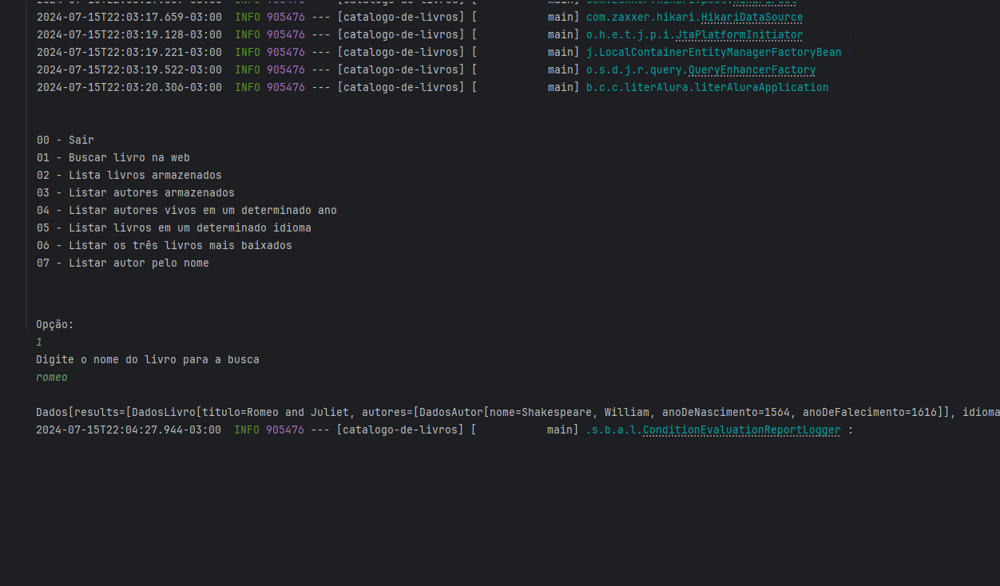

<h1 align="center"> Challenger Literalura </h1>

Challenge ONE Back End - Java.

Sprint 02: Catalogo Livros.

 

  

## 🚀 Tecnologias

Esse projeto foi desenvolvido com as seguintes tecnologias:

- Java
- Spring Boot
- PostgreSQL
- Jackson (para manipulação de JSON)
- Maven

## 💻 Projeto

## 4. ✅ Implementações
- [x] Aplicação final
    - [x] Buscar livro por título;
    - [x] Listar todos os livros;
    - [x] Listar todos os autores;
    - [x] Listar autores vivos em determinado ano;
    - [x] Exibir a quantidade de livros em determinado idioma;

O projeto CatalogoLivros é uma aplicação Java Spring Boot que busca informações de livros e autores a partir de uma API externa, armazena os dados em um banco de dados PostgreSQL e permite interação textual via console com o usuário.